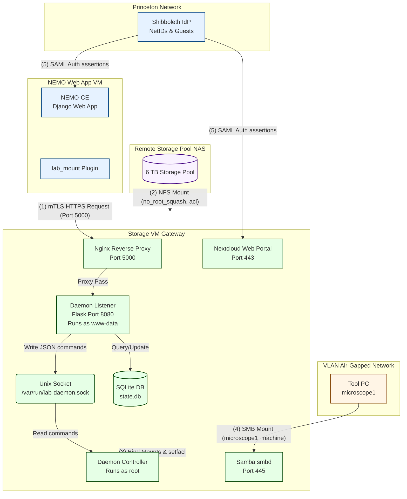

# Diagram A: Split-Server System Architecture & Data Flow

This document details the re-engineered system architecture separating the web-facing application VM, the privileged daemon controller, and the remote network storage pool.

---

## 💡 Image Generation Prompt (For Midjourney / Imagen / DALL-E)

> **Prompt:** A professional, clean 2D system architecture diagram for a secure university lab fileserver system. Designed in a clean vector style with a white background. The diagram contains four distinct color-coded regions: "NEMO Web Server VM" (Light Blue), "Storage VM Gateway" (Light Green), "Remote Storage Pool NAS" (Light Purple), and "VLAN Air-Gapped Network" (Orange).
> 
> * **NEMO Web Server VM (Light Blue):** Contains "NEMO-CE (Django Web App)" and the "lab_mount Plugin". An arrow points to the Storage VM labeled "mTLS HTTPS requests (Port 5000)".
> * **Storage VM Gateway (Light Green):** Show three compartments:
>   1. **Nginx Reverse Proxy:** Receives incoming Port 5000 requests. Verifies client TLS certificates against trusted CA.
>   2. **Daemon Listener (Unprivileged):** Running as `www-data` on Port 8080. Connected to a local SQLite `state.db`. Writes to a Unix Socket `/var/run/lab-daemon.sock`.
>   3. **Daemon Controller (Privileged):** Running as `root`. Reads from the Unix Socket and performs system operations (`mount`, `setfacl`).
>   * Also shows "Nextcloud Web Portal (Port 443)" and "Samba Server (Port 445)" running on this VM.
> * **Remote Storage Pool NAS (Light Purple):** Represents the remote 6 TB storage array. An NFS line with mount options `no_root_squash, acl` connects this storage to the Storage VM at `/srv/labdata`.
> * **VLAN Air-Gapped Network (Orange):** Shows "Tool PC (microscope1)" connecting to the Storage VM via Samba Port 445.
> * **Flows & Icons:** Clear directional vector arrows, network port labels, and simple security lock icons for mTLS.

---

## 📊 Mermaid Diagram Code

You can copy-paste the block below into any Mermaid-compatible editor (such as [mermaid.live](https://mermaid.live)):

