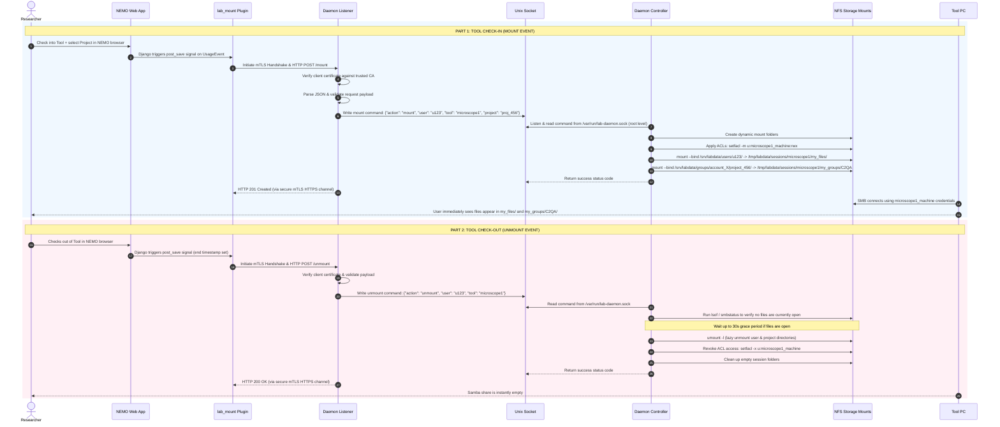

# Diagram B: Sequence Diagram (Tool Login/Logout)

This sequence diagram documents the end-to-end communication flow during tool activation and deactivation, highlighting the secure delegation of commands from the web-facing listener to the privileged root controller.

---

## 💡 Image Generation Prompt (For UML/Sequence Diagram Renderers)

> **Prompt:** A professional 2D UML sequence diagram mapping the check-in and check-out data flow in a laboratory file server system. Designed in a vector style with a white background. It features the following color-coded lifelines: "Researcher" (Purple), "NEMO Web App" (Blue), "lab_mount Plugin" (Blue), "Daemon Listener" (Green), "Unix Socket" (Light Gray), "Daemon Controller" (Dark Green), "Storage Mounts" (Purple), and "Tool PC" (Orange).
> 
> * **Mount Flow:** Step-by-step labels showing NEMO firing signals, the plugin initiating mTLS HTTPS connections, the Listener verifying certs and writing JSON command messages to the Unix socket `/var/run/lab-daemon.sock`, and the root Controller reading the socket, executing local OS actions (`mount --bind`, `setfacl`), and sending back status codes.
> * **Unmount Flow:** Sequence showing checkout triggers, lazy unmount (`umount -l`) after checking open files via `lsof`/`smbstatus`, and cleaning up folder targets and local SQLite states.

---

## 📊 Mermaid Diagram Code

You can copy-paste the block below into any Mermaid-compatible editor (such as [mermaid.live](https://mermaid.live)):

