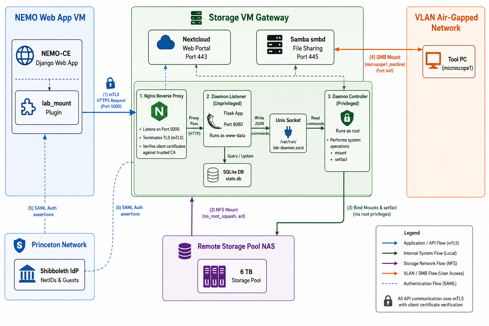

# Lab Data Mount Daemon (Flask Storage Daemon)

An automated, secure, and robust system for managing user lab session data mounts. This project integrates the **NEMO CE** Django web application with a remote **Linux Storage Daemon** via Samba and SSH tunnels to dynamically mount and unmount storage directories when users interact with physical laboratory instruments (tools).

---

## Table of Contents
1. [Problem Statement](#problem-statement)
2. [Solution Overview](#solution-overview)
3. [System Architecture](#system-architecture)
4. [Network Topology](#network-topology)
5. [Storage Layout](#storage-layout)
6. [Event Specifications](#event-specifications)
7. [API Endpoints (Daemon)](#api-endpoints-daemon)
8. [Daemon Module Specifications](#daemon-module-specifications)
9. [NEMO CE Plugin Specification](#nemo-ce-plugin-specification)
10. [Samba Configuration](#samba-configuration)
11. [Linux System Setup](#linux-system-setup)
12. [Config File Format](#config-file-format)
13. [Systemd Unit File](#systemd-unit-file)
14. [Repository Structure](#repository-structure)
15. [Tech Stack & Dependencies](#tech-stack--dependencies)
16. [Work Plan](#work-plan)
17. [Testing Plan](#testing-plan)

---

## Problem Statement
In scientific facilities, users generate massive datasets from instruments (e.g., electron microscopes, lithography systems). Storing this data locally creates disk-space bottlenecks, security issues, and data management challenges. The system must:
* Automatically provision personal and group directories on a remote storage server upon tool usage activation.
* Restrict access so users only see their directories during active sessions.
* Apply strict disk quotas to prevent storage abuse.
* Ensure files are safely closed and directories unmounted when a user checks out of a tool.

---

## Solution Overview
This system provides an end-to-end automated workflow:
1. **Tool Check-in**: A user checks into a tool in **NEMO CE** (Django). An API call is triggered to the **Daemon Listener** (Flask) running on the remote storage VPS.
2. **IPC Forwarding**: The Listener validates the request and forwards it to the root-level **Daemon Controller** via a secure Unix socket.
3. **Mounting**: The Controller creates user and group directories, applies POSIX ACLs, configures disk quotas, and bind-mounts them under the active session path.
4. **SMB Access**: The user accesses their files in real-time through an SSH tunnel to the VPS Samba share at `\\127.0.0.1\labsessions`.
5. **Tool Check-out**: When usage ends, the daemon verifies there are no open files, safely unmounts the session, and clears the directories.

---

## System Architecture
The system consists of two primary applications:
* **NEMO CE Client Plugin**: Runs inside Django; detects user log-ins/log-outs and tool check-ins to make secure API requests to the VPS.
* **Split Lab Data Mount Daemon**:
  * **Daemon Listener (Unprivileged):** Web-facing Flask server running as `www-data`. It terminates mTLS certificate validation, validates payloads, and forwards requests to the Controller.
  * **Daemon Controller (Privileged):** Root worker listening *only* on a local Unix socket. It executes low-level system mounts, quotas, and permissions.



---

## Network Topology
```
+------------------------------------+          HTTPS (mTLS)          +------------------------------------+
|            Local Host              |------------------------------->|             Remote VPS             |
|   - Django Web App (WSL)           |                                |   - Daemon Listener (Flask: 5000)  |
|   - Windows Explorer (Samba Client)|<------------------------------ |   - Unix Socket (AF_UNIX)          |
+------------------------------------+  SMB over SSH Tunnel (445:445) |   - Daemon Controller (root)       |
                                                                      |   - Samba Share (smbd: 445)        |
                                                                      +------------------------------------+
```
* **Control Channel**: Nginx listens on Port `5000` (secured by mTLS verification), proxies requests to the `daemon_listener` Flask app (running locally on port 8080), which writes commands to the local Unix socket (`/var/run/lab-daemon/lab-daemon.sock`).
* **Data Channel**: Samba server listens on Port `445` on the VPS. An SSH tunnel forwards local Windows Port `445` to the VPS Port `445` to enable secure Samba access over public networks.

---

## Storage Layout
* **User Data Store**: `/tmp/labdata/users/<username>/` (Persistent physical storage for user files)
* **Group Data Store**: `/tmp/labdata/groups/<groupname>/` (Persistent physical storage for shared group files)
* **Session Directory**: `/tmp/labdata/sessions/<username>/<tool_name>/` (Dynamic mount targets)
  - `personal/` $\rightarrow$ bind-mounted to `/tmp/labdata/users/<username>/`
  - `group/` $\rightarrow$ bind-mounted to `/tmp/labdata/groups/<groupname>/`

---

## Event Specifications
* **Mount Event (`tool_login`)**:
  - Validates request HMAC signature.
  - Ensures user and group directories exist.
  - Sets POSIX ACLs (`rwx` permissions) and user disk quotas.
  - Bind-mounts persistent directories to dynamic session paths.
* **Unmount Event (`tool_logout`)**:
  - Verifies if files are open using `lsof`.
  - If open, waits for a configurable grace period before performing a lazy unmount (`umount -l`).
  - Clears empty session directories.
* **Heartbeat Event**:
  - Validates active sessions and prevents idle timeouts.
* **Idle Timeout**:
  - Recursively scans session file access times and unmounts inactive sessions after a configured duration of inactivity.

---

## API Endpoints (Daemon)
All POST endpoints require custom HMAC-SHA256 signatures in the headers for authentication.

| Method | Endpoint | Description | Payload Parameters |
| :--- | :--- | :--- | :--- |
| `POST` | `/mount` | Mounts session directories | `session_id`, `username`, `tool_name`, `group` |
| `POST` | `/unmount` | Unmounts session directories | `session_id`, `username`, `tool_name` |
| `POST` | `/heartbeat` | Updates session active time | `session_id` |
| `GET` | `/sessions` | List active sessions | *None* |
| `GET` | `/quota/<username>` | Query disk quota usage | *None* |
| `GET` | `/health` | Verify Daemon health | *None* |

---

## Daemon Module Specifications
* **[daemon.py](daemon.py)**: Main entry point (This Repository). Handles routing, HMAC signature validation, and core server configurations.
* **[session_state.py](session_state.py)**: Thread-safe state manager using file locks (`fcntl`) to store active mounts inside `/var/lib/lab-daemon/sessions.json`.
* **[acl_manager.py](acl_manager.py)**: Wrapper around POSIX ACL commands (`setfacl`, `getfacl`) to manage directory read/write rights dynamically.
* **[quota_manager.py](quota_manager.py)**: Wrapper around Linux quota commands (`setquota`, `quota`) to enforce storage limits per user.
* **[idle_monitor.py](idle_monitor.py)**: Background thread that checks sessions for inactivity and triggers automatic logout on timeout.

---

## NEMO CE Plugin Specification
* **[signals.py](../nemo-ce/NEMO/plugins/lab_mount/signals.py)**: Listens to Django auth signals and tool check-in/check-out events. Extracts user credentials and group permissions, then delegates calls.
* **[client.py](../nemo-ce/NEMO/plugins/lab_mount/client.py)**: Handles connection logic and signs all requests with SHA-256 HMAC utilizing the shared secret.

---

## Samba Configuration
Samba is configured on the VPS (`/etc/samba/smb.conf`) to allow secure authenticated access to the session folders:
```ini
[labsessions]
    path = /tmp/labdata/sessions
    browseable = yes
    read only = no
    guest ok = no
    force user = root
```

---

## Linux System Setup
Run the following configurations on the storage host/VPS:
1. **POSIX ACLs**: Ensure the filesystem is mounted with `acl` enabled.
2. **Quotas**: Enable quotas on the root/data partition:
   ```bash
   quotacheck -cum /
   quotaon -v /
   ```
3. **Daemon Directories**: Create the library and state folders:
   ```bash
   mkdir -p /var/lib/lab-daemon
   ```

---

## Config File Format
The daemon reads settings from `/etc/lab-daemon/config.yaml` or a local `config.yaml` file:
```yaml
shared_secret: "your_hmac_secret_key"
sessions_db_path: "/var/lib/lab-daemon/sessions.json"
base_session_dir: "/tmp/labdata/sessions"
base_user_dir: "/tmp/labdata/users"
base_group_dir: "/tmp/labdata/groups"
unmount_grace_seconds: 30
idle_timeout_minutes: 60
```

---

## Systemd Unit Files
To run the split daemon system securely as background services on the VPS, install the following configurations:

### 1. Privileged Controller (`/etc/systemd/system/lab-daemon-controller.service`):
```ini
[Unit]
Description=Lab Data Mount Daemon Controller (Privileged Worker)
After=network.target

[Service]
Type=simple
User=root
WorkingDirectory=/root/nemoce-daemon
ExecStart=/root/nemoce-daemon/venv/bin/python -u daemon_controller.py
Restart=always

[Install]
WantedBy=multi-user.target
```

### 2. Unprivileged Listener (`/etc/systemd/system/lab-daemon-listener.service`):
```ini
[Unit]
Description=Lab Data Mount Daemon Listener (Unprivileged Flask Gateway)
After=network.target lab-daemon-controller.service

[Service]
Type=simple
User=www-data
Group=www-data
WorkingDirectory=/root/nemoce-daemon
ExecStart=/root/nemoce-daemon/venv/bin/python -u daemon_listener.py
Restart=always

[Install]
WantedBy=multi-user.target
```

Enable and start both services:
```bash
sudo systemctl daemon-reload
sudo systemctl enable lab-daemon-controller --now
sudo systemctl enable lab-daemon-listener --now
```

---

## Repository Structure
```
NemoProject/
├── README.md               # Project-wide documentation
├── lab-daemon/             # Remote VPS Storage Daemon (This Repository)
│   ├── arch.png            # Architecture Diagram (Embedded)
│   ├── daemon_listener.py  # Unprivileged Flask API Gateway
│   ├── daemon_controller.py# Privileged Unix Socket Command Worker
│   ├── acl_manager.py      # ACL permissions wrapper
│   ├── quota_manager.py    # Quota wrapper
│   ├── session_state.py    # Session storage database
│   ├── idle_monitor.py     # Idle tracking thread
│   ├── config.yaml         # Configuration file
│   ├── requirements.txt    # Daemon dependencies
│   └── modules/
│       ├── socket_comm.py  # Unix socket framing helper
│       ├── nemo_sync.py    # NEMO sync loop
│       └── ...
└── nemo-ce/                # Local Django Application
    ├── manage.py
    └── NEMO/
        └── plugins/
            └── lab_mount/  # Django integration plugin
                ├── README.md
                ├── signals.py
                └── client.py
```

---

## Tech Stack & Dependencies
* **Storage Daemon**: Python 3.12, Flask, PyYAML
* **NEMO CE**: Python 3.12, Django 3.2, django-rest-framework
* **Infrastructure**: Samba (smbd), OpenSSH, Linux Kernel Bind Mounts, POSIX ACLs, Linux Quota.

---

## Work Plan
* **Phase 1**: Implement core Flask daemon endpoints.
* **Phase 2**: Add quota and ACL integration.
* **Phase 3**: Implement session locking and idle timeout checking.
* **Phase 4**: Setup the NEMO CE plugin client and sign payloads.
* **Phase 5**: Deploy to VPS and route Samba traffic via SSH tunnel.

---

## Testing Plan
1. **Unit and Integration Suite**: Execute local mock tests inside WSL using [run_wsl_tests.py](run_wsl_tests.py) to assert mounts, ACL checks, and quota functionality.
2. **Samba Tunnel Verification**: Connect the Windows client to `\\127.0.0.1\labsessions` using `net use` with the `dev` user credentials.
3. **End-to-End Demo**: Verify that check-ins from Chrome immediately expose directories, and checkout triggers automatic cleanup.
